# Comparación del análisis SCA

Se generó un SBOM CycloneDX del proyecto y se analizó con Trivy, tanto localmente como mediante GitHub Actions. La actualización de Apache Commons Text de **1.9 a 1.10.0** eliminó **CVE-2022-42889** del reporte posterior. Las pruebas del proyecto pasaron antes y después.

El quality gate permaneció bloqueado: los hallazgos HIGH/CRITICAL disminuyeron de **24 a 23**, pero otros componentes siguen afectados según el reporte. Los archivos del análisis se publicaron incluso cuando el gate falló. Dependency graph, Dependabot alerts y Dependabot security updates se habilitaron en GitHub. El YAML se incorporó a `main` mediante el PR #2 y se observaron propuestas automáticas para Maven y GitHub Actions.

## Identificación

| Campo | Valor |
|---|---|
| Grupo / integrantes | Trabajo individual |
| Repositorio | [jhersON1/module5-diplo](https://github.com/jhersON1/module5-diplo) |
| Rama del laboratorio | `lab/sca-sbom` |
| Commit de partida | `d8429576cbc25908571b2e15f69801e1487a1cc8` |
| Commit anterior analizado | [36c3bfd06ebd7b9d8e4b94d3f06f66cb3a5f76f1](https://github.com/jhersON1/module5-diplo/commit/36c3bfd06ebd7b9d8e4b94d3f06f66cb3a5f76f1) |
| Commit posterior analizado | [070ce96132f840b0321d471e7419e12846802a17](https://github.com/jhersON1/module5-diplo/commit/070ce96132f840b0321d471e7419e12846802a17) |
| Ejecución anterior | [SCA y SBOM #1](https://github.com/jhersON1/module5-diplo/actions/runs/37559795615) |
| Ejecución posterior | [SCA y SBOM #3](https://github.com/jhersON1/module5-diplo/actions/runs/37561324791) |
| Pull request | [PR #1: Add SCA/SBOM workflow and remediate Commons Text](https://github.com/jhersON1/module5-diplo/pull/1) |
| PR de activación de Dependabot | [PR #2: Enable Dependabot for Maven and GitHub Actions](https://github.com/jhersON1/module5-diplo/pull/2), fusionado en `main` |
| Análisis anterior, hora de Bolivia | 6 de octubre de 2026, 22:00:20, UTC−04:00 |
| Análisis posterior, hora de Bolivia | 6 de octubre de 2026, 22:19:02, UTC−04:00 |

Las fechas se obtuvieron de `CreatedAt` de los reportes de Actions y se convirtieron a la zona horaria de Bolivia. El [commit 322df83](https://github.com/jhersON1/module5-diplo/commit/322df83760d515c57685764ff2422a3a16c47737) incorporó Dependabot entre las dos ejecuciones seleccionadas; su ejecución #2 no sustituye el reporte inicial conservado. Los enlaces a commits identifican los cambios, pero no sustituyen las URLs de las ejecuciones de Actions.

## Herramientas y alcance

| Herramienta | Versión / configuración comprobada |
|---|---|
| Java local | Temurin 21.0.12 |
| Maven local | 3.10.0 |
| Docker Engine local | 28.5.1, contenedores Linux |
| Java del workflow | Temurin 21 |
| CycloneDX Maven Plugin | 2.9.3 |
| SBOM | JSON, CycloneDX 1.6; 53 componentes en las generaciones mostradas |
| Trivy | 0.74.0 |
| Umbral del gate | HIGH y CRITICAL, `--exit-code 1` |
| Publicación de artifacts | `if: always()`, retención de 7 días |

El plugin incluye dependencias de compilación, ejecución y scope provided. Excluye las exclusivas de pruebas y las de scope system. El SBOM representa ese inventario Maven; no inventaría todas las herramientas de desarrollo ni todas las bibliotecas del sistema operativo.

## Dependencias directas y transitivas

El árbol se obtuvo con `mvn dependency:tree` y se conservó en [local-antes/dependency-tree.txt](local-antes/dependency-tree.txt).

| Dependencia | Versión resuelta | Tipo | Quién la incorpora |
|---|---|---|---|
| `org.springframework.boot:spring-boot-starter-web` | 3.5.14 | Directa | Declarada en `pom.xml` |
| `com.fasterxml.jackson.core:jackson-databind` | 2.21.2 | Transitiva | `spring-boot-starter-web → spring-boot-starter-json → jackson-databind` |
| `org.apache.tomcat.embed:tomcat-embed-core` | 10.1.54 | Transitiva | `spring-boot-starter-web → spring-boot-starter-tomcat → tomcat-embed-core` |

El árbol contiene más componentes que los declarados explícitamente en el POM porque las dependencias directas incorporan sus propias dependencias. El parent `spring-boot-starter-parent:3.5.14` administra varias versiones; la ausencia de `<version>` en una declaración no implica que el componente carezca de versión resuelta.

## Hallazgo seleccionado

| Campo | Antes | Después |
|---|---|---|
| Componente | `org.apache.commons:commons-text` | `org.apache.commons:commons-text` |
| Versión resuelta | 1.9 | 1.10.0 |
| CVE seleccionado | CVE-2022-42889 | CVE-2022-42889 |
| Severidad del hallazgo seleccionado | CRITICAL | No reportado |
| Presencia del hallazgo en el JSON completo | Sí: 1 aparición | No: 0 apariciones |
| Estado del quality gate | Fallido: 24 HIGH/CRITICAL | Fallido: 23 HIGH/CRITICAL restantes |

La dependencia es **directa**, ya que está declarada en el POM. Se incluyó como caso didáctico del laboratorio. En el código fuente revisado no se encontró uso de Commons Text ni de `StringSubstitutor`.

Apache identifica 1.10.0 como la corrección histórica del CVE seleccionado. El hallazgo por versión no demuestra por sí solo un endpoint explotable: la explotación depende del uso susceptible de la interpolación. Esta comparación documenta detección y remediación de una dependencia. [Aviso oficial de Apache Commons Text](https://commons.apache.org/proper/commons-text/security.html).

## Cambio y comprobación de compatibilidad

El cambio de remediación modificó únicamente la versión de Commons Text en el POM:

```diff
-    <version>1.9</version>
+    <version>1.10.0</version>
```

Antes y después se ejecutó:

```powershell
mvn -B clean verify
mvn dependency:tree '-Dincludes=org.apache.commons:commons-text'
mvn -B org.cyclonedx:cyclonedx-maven-plugin:2.9.3:makeAggregateBom
```

| Resultado de las pruebas locales | Antes | Después |
|---|---|---|
| Tests run | 2 | 2 |
| Failures | 0 | 0 |
| Errors | 0 | 0 |
| Skipped | 0 | 0 |
| Maven | BUILD SUCCESS | BUILD SUCCESS |

Se conservaron los resúmenes de Surefire en [tests-iniciales.txt](local-antes/tests-iniciales.txt) y [tests-despues.txt](local-despues/tests-despues.txt). Las dos pruebas existentes verifican la búsqueda de productos y la disponibilidad del endpoint administrativo del laboratorio. Su resultado verifica esos casos; no demuestra cobertura funcional exhaustiva ni que la aplicación haya dejado de ser deliberadamente vulnerable.

Las capturas de Actions muestran que compilación, generación del SBOM y generación del reporte completo terminaron correctamente en las dos ejecuciones seleccionadas. El único paso de análisis fallido fue **Quality gate HIGH y CRITICAL**. La publicación de evidencias se ejecutó después del fallo.

## Comparación de los reportes de Actions

| Severidad | Antes | Después | Diferencia |
|---|---:|---:|---:|
| CRITICAL | 8 | 7 | −1 |
| HIGH | 16 | 16 | 0 |
| MEDIUM | 23 | 23 | 0 |
| LOW | 5 | 5 | 0 |
| Total del reporte completo | 52 | 51 | −1 |
| Total que bloquea el gate | 24 | 23 | −1 |

Estos números corresponden a hallazgos del escáner, no a cantidades de bibliotecas únicas ni a vulnerabilidades explotables confirmadas. Se compararon los JSON completos de los artifacts anteriores y posteriores; no se mezclaron con el reporte local.

La evidencia de eliminación del CVE seleccionado es: Commons Text cambia a 1.10.0 en el SBOM posterior, y `CVE-2022-42889` pasa de una aparición a cero en el reporte JSON completo. La búsqueda sin resultados en el gate posterior es una evidencia complementaria.

| Ejecución | SBOM | Reporte completo | Reporte del gate |
|---|---|---|---|
| Anterior, commit `36c3bfd` | [bom.json](actions-antes/bom.json) | [sca-report.json](actions-antes/sca-report.json) | [sca-gate.txt](actions-antes/sca-gate.txt) |
| Posterior, commit `070ce96` | [bom.json](actions-despues/bom.json) | [sca-report.json](actions-despues/sca-report.json) | [sca-gate.txt](actions-despues/sca-gate.txt) |

Se guardaron también [la identificación anterior](actions-antes/identificacion.json) y [la identificación posterior](actions-despues/identificacion.json), con commits, versión de Trivy, fechas de los reportes y URLs de ejecución. Los enlaces fueron proporcionados por el participante y los resultados se comprobaron con los artifacts descargados y las capturas.

## Hallazgos pendientes

El reporte posterior mantiene estos HIGH/CRITICAL:

| Componente | Versión instalada | HIGH | CRITICAL | Total |
|---|---|---:|---:|---:|
| `com.fasterxml.jackson.core:jackson-core` | 2.21.2 | 3 | 0 | 3 |
| `com.fasterxml.jackson.core:jackson-databind` | 2.21.2 | 5 | 0 | 5 |
| `io.micrometer:micrometer-core` | 1.15.11 | 2 | 0 | 2 |
| `org.apache.tomcat.embed:tomcat-embed-core` | 10.1.54 | 3 | 6 | 9 |
| `org.springframework:spring-expression` | 6.2.18 | 1 | 0 | 1 |
| `org.springframework:spring-webmvc` | 6.2.18 | 2 | 1 | 3 |
| **Total** | | **16** | **7** | **23** |

Sus identificadores y versiones corregidas indicadas pueden consultarse en el JSON posterior. Su remediación queda pendiente de revisar compatibilidad, versiones administradas por el parent/BOM y avisos de los mantenedores. No se cambiaron el umbral ni el comportamiento de bloqueo para obtener un resultado verde.

La actualización a 1.10.0 corrige el caso histórico seleccionado; no representa una recomendación de versión vigente ni una garantía general de seguridad. La dependencia de ejemplo puede retirarse al cerrar la práctica, después de conservar esta comparación y repetir las verificaciones.

## Dependabot

La configuración [`.github/dependabot.yml`](../../.github/dependabot.yml) incluye Maven y GitHub Actions, con frecuencia semanal y límite de cinco PRs abiertos por ecosistema.

La captura de configuración final muestra:

| Función | Estado observado |
|---|---|
| Dependency graph | On |
| Dependabot alerts | On |
| Dependabot security updates | On |
| Grouped security updates | On; opción adicional, no requisito del caso principal |
| Dependabot version updates | YAML incorporado a `main` por el PR #2; propuestas automáticas observadas para Maven y GitHub Actions |

Las alertas notifican vulnerabilidades detectadas; security updates intenta crear PRs de corrección; version updates busca versiones nuevas conforme al YAML. La activación de actualizaciones programadas requiere la configuración en la rama predeterminada. [Documentación oficial de GitHub](https://docs.github.com/en/code-security/how-tos/secure-your-supply-chain/secure-your-dependencies/configure-version-updates).

La corrección de Commons Text se hizo manualmente. No se utilizó un PR de Dependabot para efectuar ese cambio.

Se abrió el [PR #2](https://github.com/jhersON1/module5-diplo/pull/2), desde `feat/dependabot-config` hacia `main`, con el commit `023dfc6749d758d2d5a1a3f8640182e48e596bc1`. Su diff contiene únicamente `.github/dependabot.yml`, con 13 líneas añadidas. La captura previa al merge muestra ocho checks correctos y cinco omitidos. La captura posterior confirma el estado **Merged** y el commit de merge abreviado `c2168a0`.

Las capturas de Actions posteriores muestran PRs abiertos por `dependabot[bot]` para ambos ecosistemas. Entre los ejemplos observados están `docker/metadata-action` de 5 a 6 (PR #12), `actions/checkout` de 4 a 7 (PR #10), `jacoco-maven-plugin` de 0.8.13 a 0.8.15 (PR #7) y el parent de Spring Boot de 3.5.14 a 4.1.1 (PR #11). Estas propuestas confirman la actividad de Dependabot; no equivalen a actualizaciones ya fusionadas ni a una comprobación completa de compatibilidad.

La propuesta del parent de Spring Boot presenta fallos en los workflows CI y CI/CD, mientras Semgrep termina correctamente. La causa concreta no puede determinarse con el listado de ejecuciones mostrado: requiere revisar los logs. Esa propuesta queda pendiente de revisión y no forma parte de la remediación manual comparada aquí. El PR #2 incorpora únicamente la configuración; el workflow SCA y la corrección de Commons Text siguen en el PR #1 del laboratorio.

## Capturas de evidencia

### 1. Entorno preparado

Java 21, Maven 3.10.0 y Docker con cliente y motor disponibles.

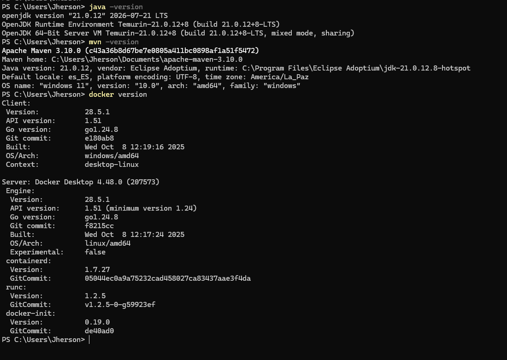

### 2. Compilación inicial

Maven finaliza con BUILD SUCCESS. El resumen de las pruebas se conserva adicionalmente en el archivo de Surefire enlazado arriba.

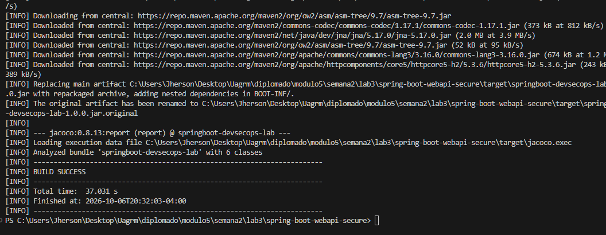

### 3. Dependencias directas y transitivas

El árbol muestra el starter web, Jackson y Tomcat con sus versiones resueltas.

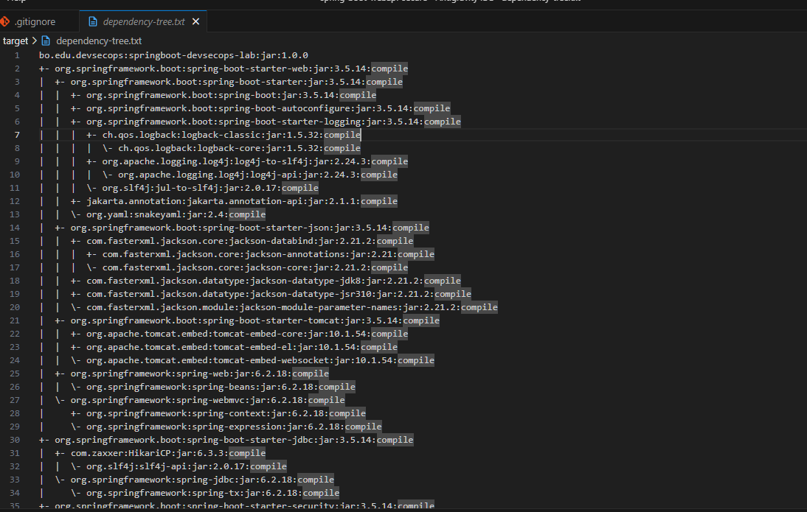

### 4. SBOM anterior

Se observa CycloneDX 1.6, la aplicación inventariada, Jackson Databind 2.21.2 y Commons Text 1.9.

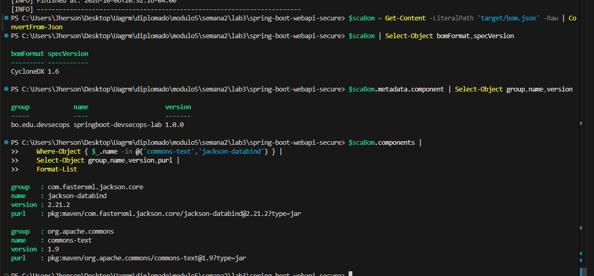

### 5. Análisis local anterior

Trivy identifica CVE-2022-42889 en Commons Text 1.9 con severidad CRITICAL.

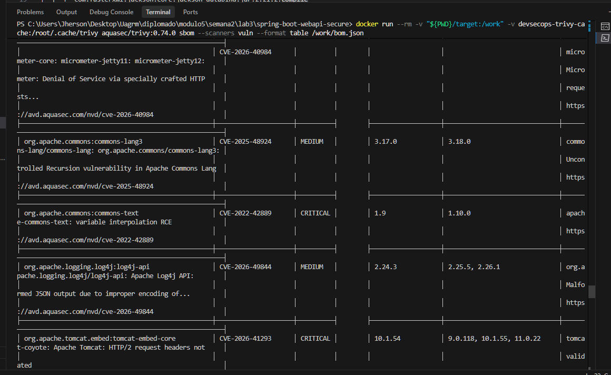

### 6. Gate y publicación de evidencias en Actions

Los pasos anteriores al gate terminan correctamente, el gate falla y la publicación de evidencias se ejecuta.

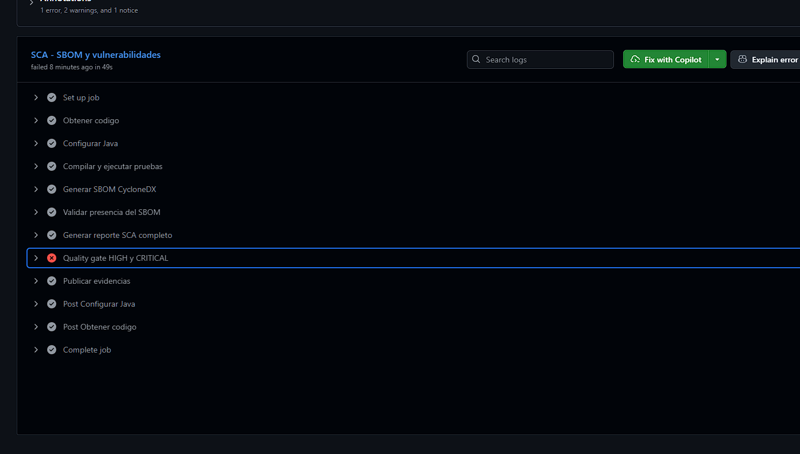

### 7. Hallazgo seleccionado en el artifact anterior

La fila relaciona Commons Text 1.9 con el CVE seleccionado y la corrección indicada en 1.10.0.

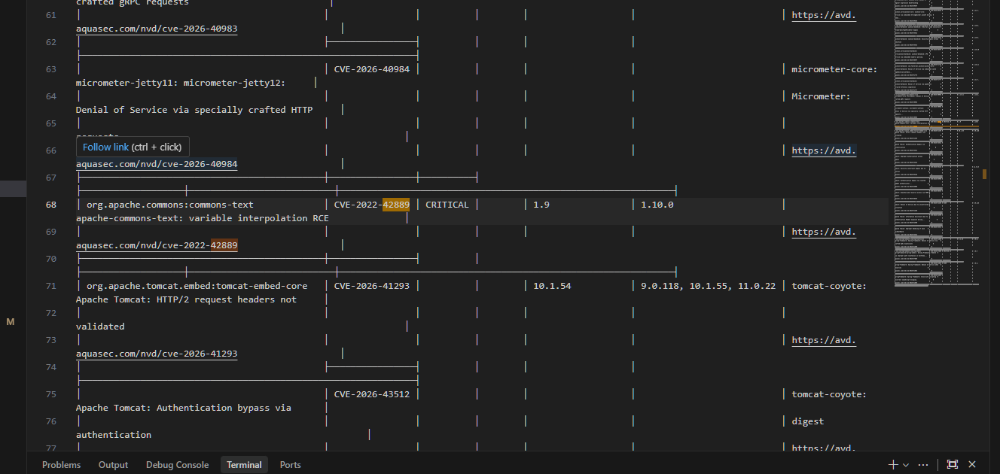

### 8. Configuración de GitHub habilitada

Dependency graph, alerts y security updates muestran On.

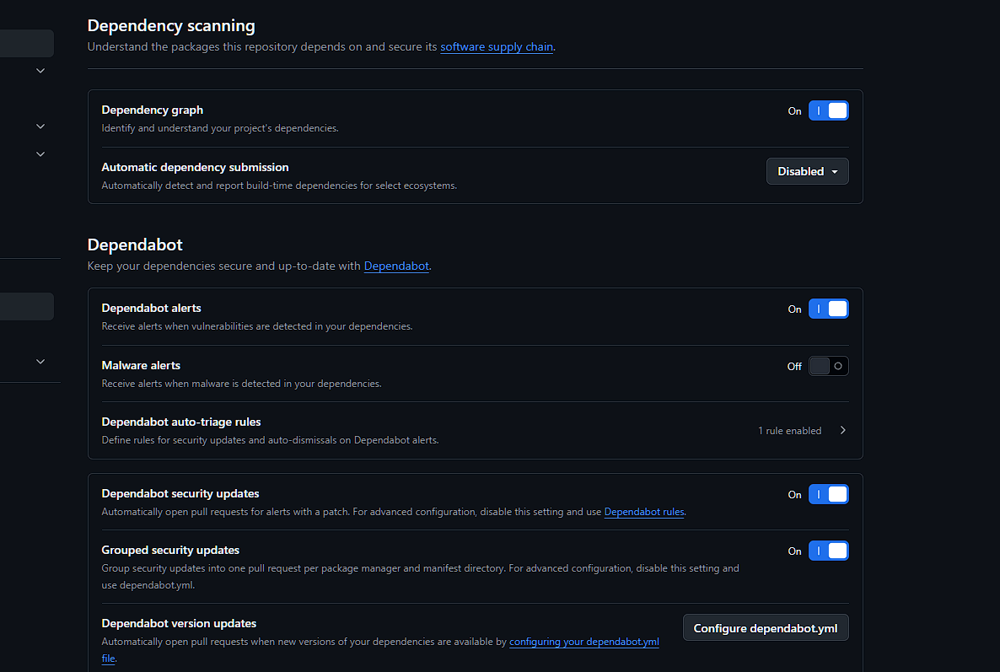

### 9. Cambio en el POM

El diff muestra la actualización de 1.9 a 1.10.0.

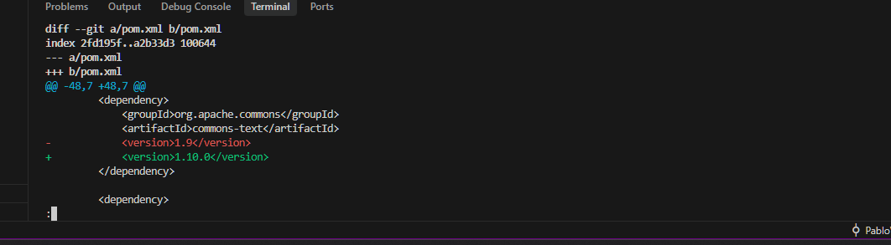

### 10. Pruebas posteriores

Dos pruebas ejecutadas, cero fallos y cero errores; Maven termina con BUILD SUCCESS.

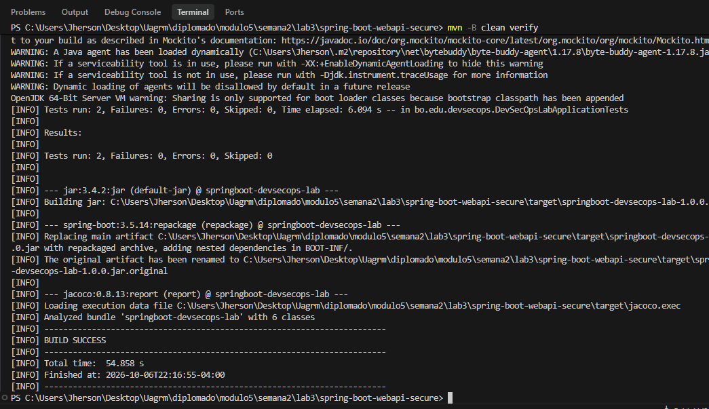

### 11. Ejecución posterior de Actions

Compilación y reportes correctos; el gate sigue bloqueando los demás HIGH/CRITICAL.

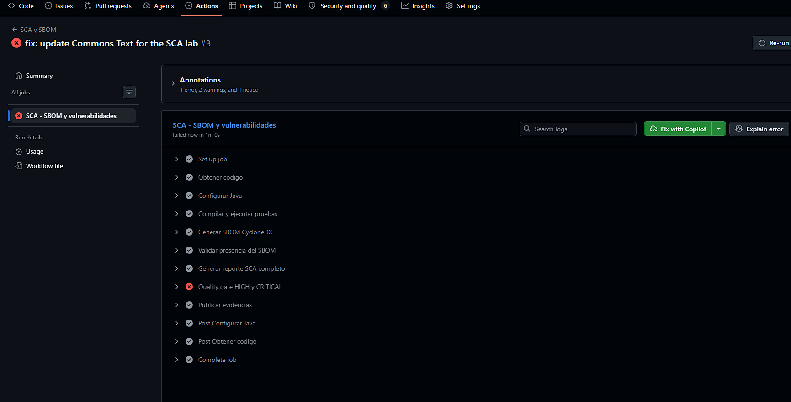

### 12. Ausencia del hallazgo seleccionado

En el gate posterior la búsqueda del identificador seleccionado no encuentra coincidencias. La verificación principal se realizó además sobre el JSON completo: cero apariciones.

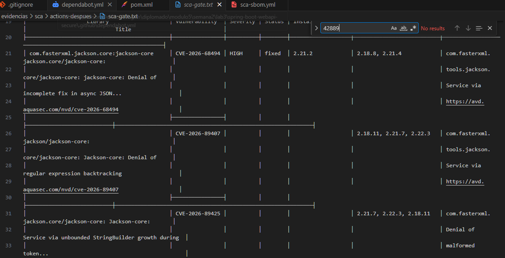

### 13. Pull request

Se abrió el [PR #1](https://github.com/jhersON1/module5-diplo/pull/1), de `lab/sca-sbom` hacia `main`, con los tres commits de workflow, configuración de Dependabot y corrección de Commons Text. Su descripción registra la eliminación del CVE seleccionado y los 23 HIGH/CRITICAL pendientes.

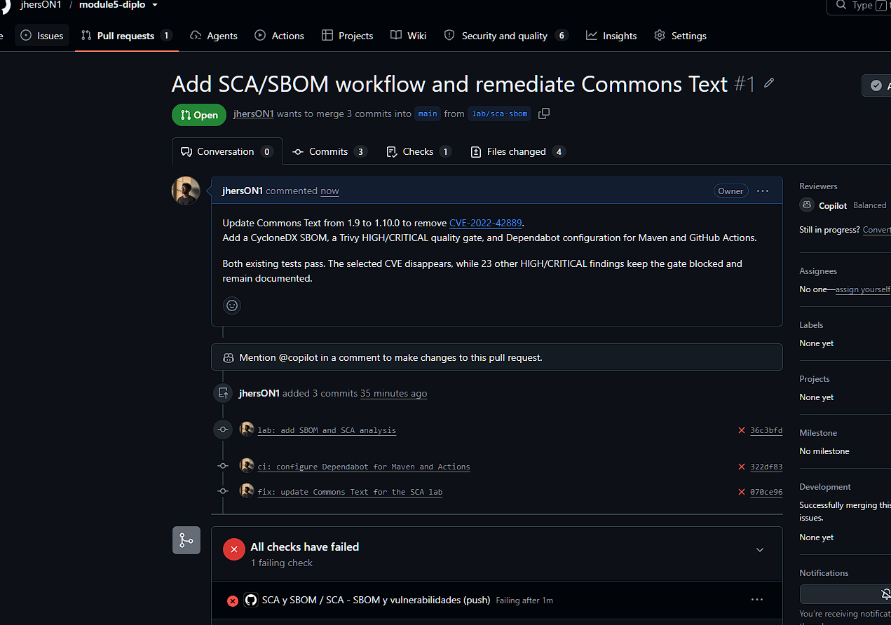

La captura posterior del resumen de checks muestra 2 fallidos, 5 omitidos y 8 correctos. Entre los correctos aparecen Build & Test, CodeQL y Semgrep. Los resultados de estas herramientas no sustituyen el análisis de dependencias.

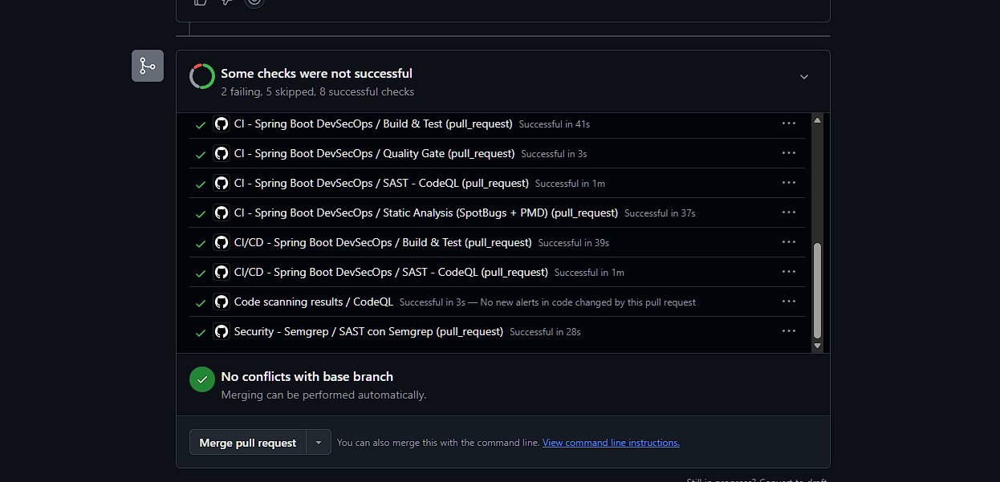

GitHub muestra el botón de merge disponible pese a los checks fallidos. El fallo del workflow demuestra el bloqueo del job; esta captura no demuestra una regla que exija ese check para fusionar. El gate posterior permanece rojo por los pendientes documentados.

### 14. Configuración de Dependabot incorporada a main

El diff del PR #2 muestra que únicamente se añadió el YAML de Maven y GitHub Actions. Las capturas adicionales conservan el resumen de checks y la confirmación del merge.

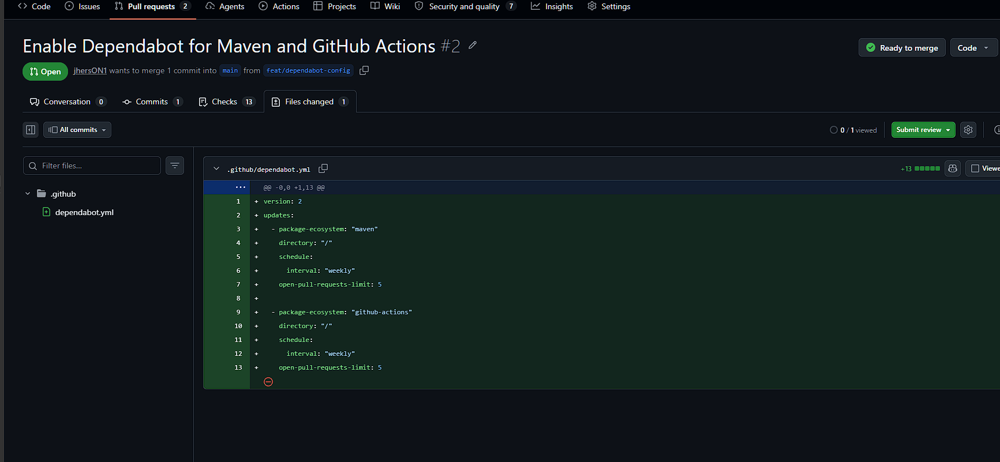

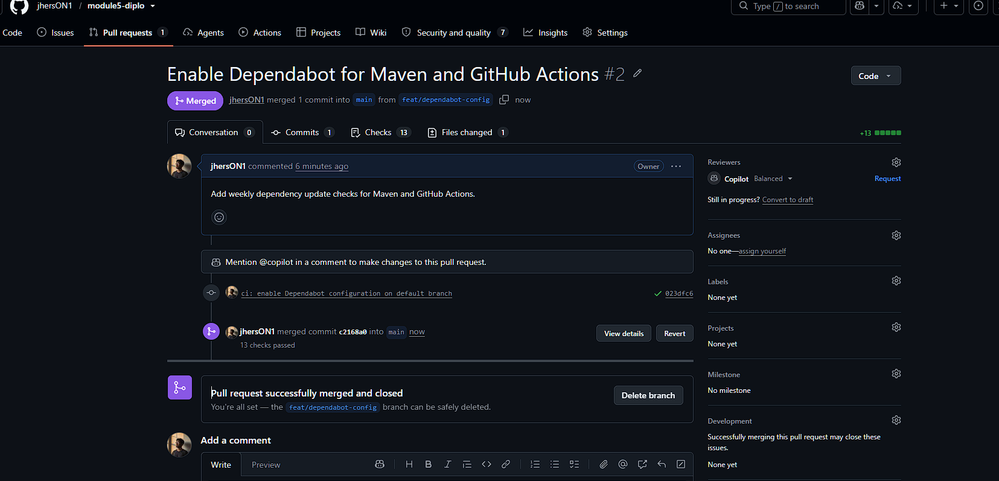

### 15. Propuestas automáticas de Dependabot

El listado de Actions identifica PRs abiertos por Dependabot para Maven y GitHub Actions. Algunos checks pasan y otros fallan; cada propuesta debe revisarse antes de fusionar.

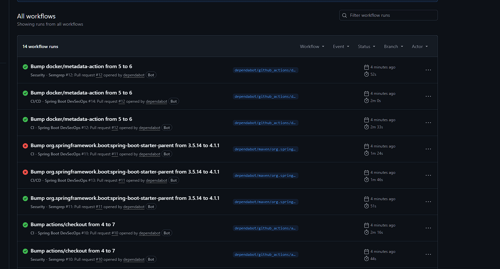

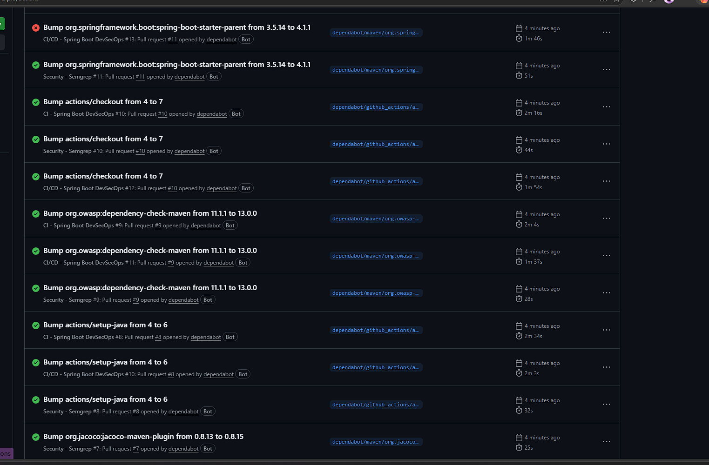

## Lista de comprobación de la entrega

- [x] Entorno preparado y proyecto compilado con pruebas.
- [x] Dependencias directas y transitivas identificadas con versiones reales.
- [x] SBOM inicial y posterior conservados.
- [x] Hallazgo objetivo observado en el análisis inicial.
- [x] Workflow con umbral HIGH/CRITICAL y publicación de artifacts.
- [x] Configuración de Dependabot para Maven y Actions creada.
- [x] Dependency graph, alerts y security updates habilitados.
- [x] Actualización comprobada mediante pruebas y reportes de Actions.
- [x] Hallazgos restantes y límites del análisis documentados.
- [x] YAML de Dependabot incorporado a la rama predeterminada y version updates comprobado mediante propuestas automáticas.
- [x] Modalidad de trabajo individual registrada.
- [x] URLs de las dos ejecuciones y del PR registradas.
- [x] Captura del PR incorporada.
- [x] Evidencias reunidas en `evidencias/sca/`: SBOM, reportes, identificación por commit y capturas con enlaces locales comprobados.

La extensión con Snyk no se realizó. Es opcional en el documento del taller.
